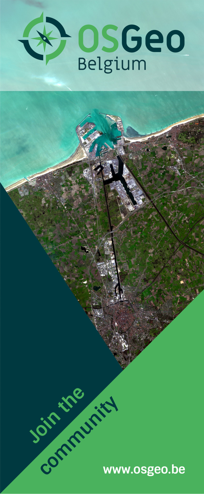

# OSGeo-be branding materials

## Logo

Some logo propositions:


## Banner



To generate `banner.svg` (which embeds the fonts and image in the svg template)

```shell
python embed.py banner/banner.tpl.svg banner/banner.svg
```

To go from svg to png from the command line:

```shell
inkscape -z -e /full/path/to/banner/banner.png -a=0:-8034:3370:100 /full/path/to/banner/banner.svg
```
